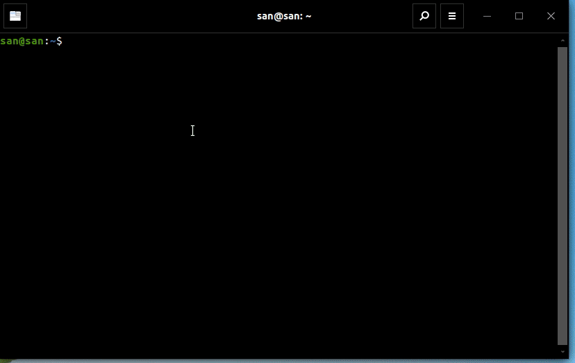

# Simple Kanban Folders

Kanban folders allows you to create a kanban board per folder.

It creates a .kanban file inside your folder, so you can have a separate kanban board for every folder (or project).   

## Screenshot



## Benefits

- Maintains a separate kanban file in each directory (so easy to create a kanban board per project / folder)
- No messy installation, just clone the repo and you're set! 
- Super simple .kanban JSON file format (can be hand edited or piped to any program as needed).
- Works in every resolution or window size thanks to responsive CSS!
- About 100 lines of super simple PHP / Vuejs code (great for learning as a weekend project)
- Automatic backups (since the .kanban file is inside the folder / project you don't need to create separate backups)
- Should work easily on Windows / Mac too (just need to port bash script ~ about 10 lines)

## FAQ

Q. Why should I use this very limited kanban board when i can use something like Trello that has 100 more features?

A. The same reason you want to run a local to-do program instead of todoist. 
It runs locally, and you can create a new kanban board inside each directory to track progress of the work in that folder (like tests or scripts in that directory only).
  

## Requirements

- PHP 7+

If you don't have PHP on your machine just run `sudo apt install php`

## Installation

Just clone this repo and add the directory to your path (update `$PATH` in `.bashrc`)

````
git clone git://github.com/san-kumar/kanban ~/kanban
echo 'PATH="$PATH:~/kanban"' >> ~/.bashrc
source ~/.bashrc
cd ~/your-project-dir
kanban
````

*Tip: Always make sure what the commands do - before you start copy-pasting stuff in terminal ;)*

## Running

Just run `kanban` in any directory in which you want to create a new kanban list. It should open up your web browser and you should see your kanban list!

The program basically creates/reads a `.kanban` file (JSON) using the PHP and opens the editor in your favorite web browser.

## Uninstalling

Just delete the `~/kanban` directory and undo any changes to `$PATH`. Also run `killall php` to stop the PHP server.

## About

It is just a 100 lines of PHP & Javascript. The front-end uses Vuejs and Milligram framework. Took me less than 2 hours to write it including this README file &#x263A;

Made it to scratch my own itch but in case someone finds it useful let me know!

